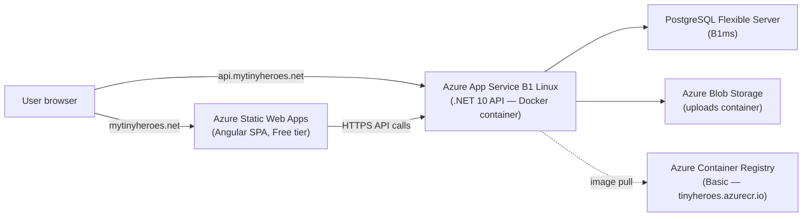
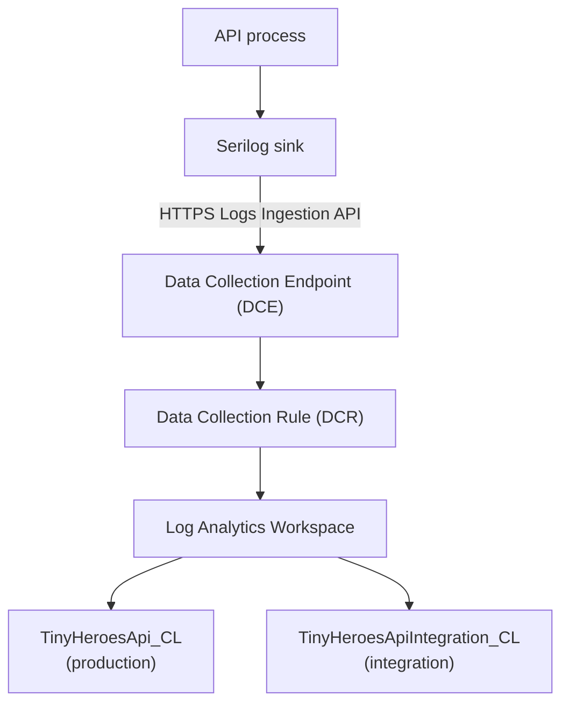

# Deployment

TinyHeroes is hosted on Azure at `mytinyheroes.net`. Deployment is fully automated on push to `master` via GitHub Actions.

---

## Table of Contents

- [Releasing a New Version](#releasing-a-new-version)
- [Architecture](#architecture)
- [Azure Resources](#azure-resources)
- [CI/CD Pipeline](#cicd-pipeline)
- [Integration Environment](#integration-environment)
- [First-Time Deployment (from zero)](#first-time-deployment-from-zero)
- [App Service Environment Variables](#app-service-environment-variables)
- [Structured Logging Setup (Azure Log Analytics)](#structured-logging-setup-azure-log-analytics)
- [Application Insights Setup (Metrics + Traces)](#application-insights-setup-metrics--traces)
- [DNS](#dns)
- [Self-Hosted CI Runner (M5 Pro Mac)](#self-hosted-ci-runner-m5-pro-mac)
- [Email Stack](#email-stack)
- [Scaling Path](#scaling-path)

---

## Releasing a New Version

TinyHeroes follows [Semantic Versioning](https://semver.org/): `MAJOR.MINOR.PATCH`

| Change | Bump |
|---|---|
| Breaking change (API contract, auth flow, DB schema change requiring manual migration) | MAJOR |
| New feature, new endpoint, new UI page | MINOR |
| Bug fix, copy change, dependency update, config fix | PATCH |

Update these three files together in a single commit before pushing:

| File | Field |
|---|---|
| `backend/TinyHeroes.Api/TinyHeroes.Api.csproj` | `<Version>` and `<InformationalVersion>` |
| `frontend/src/environments/environment.ts` | `version` |
| `frontend/src/environments/environment.prod.ts` | `version` |

```bash
# After editing all three files:
git add backend/TinyHeroes.Api/TinyHeroes.Api.csproj \
        frontend/src/environments/environment.ts \
        frontend/src/environments/environment.prod.ts
git commit -m "chore: bump version to X.Y.Z"
git push
```

The version is exposed at runtime via `GET /api/info` (backend) and displayed on the welcome screen and in Settings (frontend).

---

## Architecture



---

## Azure Resources

| Resource | Tier | Purpose | Est. $/mo |
|---|---|---|---|
| Azure Static Web Apps | Free | Angular SPA + CDN + auto SSL | $0 |
| Azure App Service Plan | B1 Linux | Hosts .NET API container | $13 |
| Azure Container Registry | Basic | Docker image store | $5 |
| Azure Database for PostgreSQL Flexible Server | B1ms | Managed Postgres 16, auto-backups | $13 |
| Azure Blob Storage | LRS Standard | File uploads | ~$1 |
| **Total** | | | **~$32/mo** |

---

## CI/CD Pipeline

**File:** [`.github/workflows/deploy.yml`](../.github/workflows/deploy.yml)
**Trigger:** push to `master`

Two parallel jobs run on every push:

**deploy-frontend**
1. `npm ci` + `npm run build` in `frontend/`
2. Uploads `dist/frontend/browser/` to Azure Static Web Apps

**deploy-api**
1. Builds Docker image from `backend/TinyHeroes.Api/Dockerfile`
2. Pushes image to ACR as `tinyheroes-api:latest`
3. Tells App Service to pull the new image

### Required GitHub Secrets

| Secret | Where to find it |
|---|---|
| `AZURE_STATIC_WEB_APPS_API_TOKEN` | `az staticwebapp secrets list` (see first-time deployment guide) |
| `ACR_LOGIN_SERVER` | Bicep output `acrLoginServer` |
| `ACR_USERNAME` | Bicep output `acrUsername` |
| `ACR_PASSWORD` | `az acr credential show` (see first-time deployment guide) |
| `AZURE_APP_SERVICE_NAME` | Bicep output `appServiceName` |
| `AZURE_WEBAPP_PUBLISH_PROFILE` | `az webapp deployment list-publishing-profiles` (see first-time deployment guide) |

---

## Integration Environment

A permanent integration environment mirrors production at `integration.mytinyheroes.net`.

| URL | Purpose |
|---|---|
| `https://integration.mytinyheroes.net` | Angular frontend |
| `https://api.integration.mytinyheroes.net` | .NET API |

### Trigger

Every push to any branch **except `master`** triggers `.github/workflows/deploy-integration.yml`, which:
1. Runs the full backend + frontend test suite
2. Builds the Angular app with the `integration` configuration (pointing at `api.integration.mytinyheroes.net/api`)
3. Pushes the Docker image to ACR as `tinyheroes-api:integration`
4. Deploys both services to the integration Azure resources

### Demo Credentials

The API starts with `ASPNETCORE_ENVIRONMENT=Integration`, which triggers `DatabaseSeeder` at every cold start:
- **Email:** `testuser@demo.com`
- **Password:** `Password1!`
- **Family:** "Demo Family", children Alice (5) and Bob (7)

The database is dropped and reseeded on every API restart/redeploy.

### Azure Resources

| Resource | Name | Cost | Notes |
|---|---|---|---|
| Azure App Service (web app) | `tinyheroes-api-integration` | **$0 extra** | Added to existing B1 plan (`alwaysOn: false` — sleeps when idle) |
| Azure Static Web App (Free) | `tinyheroes-frontend-integration` | **$0** | Free tier |
| PostgreSQL database | `tinyheroes_integration` | **$0 extra** | Added to existing Flexible Server |

Shares the existing ACR (`tinyheroesacr`) with image tag `tinyheroes-api:integration`. **Total additional monthly cost: $0.**

### Additional GitHub Secrets Required

| Secret | Description |
|---|---|
| `AZURE_STATIC_WEB_APPS_API_TOKEN_INTEGRATION` | SWA deployment token for integration |
| `AZURE_APP_SERVICE_NAME_INTEGRATION` | `tinyheroes-api-integration` |
| `AZURE_WEBAPP_PUBLISH_PROFILE_INTEGRATION` | Publish profile XML for integration App Service |

### First-Time Provisioning

```bash
az deployment group create \
  --resource-group rg-tinyheroes \
  --template-file infra/main.integration.bicep \
  --parameters infra/main.integration.bicepparam \
  --parameters \
    postgresAdminPassword="<same-password-as-prod-postgres>" \
    jwtSecret="<any-32+-char-string>" \
    repositoryToken="<github-pat>"
```

After provisioning, collect secrets:

```bash
# SWA deployment token
az staticwebapp secrets list --name tinyheroes-frontend-integration --query properties.apiKey -o tsv

# App Service publish profile (full XML)
az webapp deployment list-publishing-profiles \
  --name tinyheroes-api-integration \
  --resource-group rg-tinyheroes \
  --xml
```

Add two CNAMEs in Cloudflare (mytinyheroes.net):

```
integration.mytinyheroes.net      CNAME  <swa-hostname>.azurestaticapps.net
api.integration.mytinyheroes.net  CNAME  tinyheroes-api-integration.azurewebsites.net
```

---

## First-Time Deployment (from zero)

### Step 1 — Prerequisites

```bash
brew install azure-cli
az login

az bicep install
```

### Step 2 — Generate a GitHub Personal Access Token

GitHub → Settings → Developer settings → Personal access tokens → Fine-grained tokens.

Grant **read/write** on **Actions** and **Administration** for the TinyHeroes repo. Copy the token — it becomes `repositoryToken`.

### Step 3 — Provision Azure Infrastructure

Infrastructure is defined as Bicep in `infra/`:

```
infra/
├── main.bicep
├── main.prod.bicepparam
└── modules/
    ├── acr.bicep
    ├── postgres.bicep
    ├── storage.bicep
    ├── appservice.bicep
    └── swa.bicep
```

```bash
az group create --name rg-tinyheroes --location westeurope

az deployment group create \
  --resource-group rg-tinyheroes \
  --template-file infra/main.bicep \
  --parameters infra/main.prod.bicepparam \
  --parameters \
    postgresAdminPassword="<strong-password>" \
    jwtSecret="<random-32+-char-string>" \
    repositoryToken="<github-pat-from-step-2>" \
    huggingFaceApiKey="<your-hf-key-or-empty-string>"
```

Secrets are passed as parameters at deploy time and never committed to git.

Note the outputs — needed in the next steps:

```
acrLoginServer      → e.g. tinyheroesacr.azurecr.io
acrUsername         → e.g. tinyheroesacr
appServiceName      → e.g. tinyheroes-api
appServiceHostname  → e.g. tinyheroes-api.azurewebsites.net
swaHostname         → e.g. <hash>.azurestaticapps.net
```

To retrieve outputs later:
```bash
az deployment group show -g rg-tinyheroes -n main --query properties.outputs
```

### Step 4 — Collect Remaining Secrets

**ACR password:**
```bash
az acr credential show --name tinyheroesacr --query passwords[0].value -o tsv
```

**SWA deployment token:**
```bash
az staticwebapp secrets list --name tinyheroes-frontend --query properties.apiKey -o tsv
```

**App Service publish profile** (full XML):
```bash
az webapp deployment list-publishing-profiles \
  --name tinyheroes-api \
  --resource-group rg-tinyheroes \
  --xml
```

### Step 5 — Set GitHub Secrets

Repo → Settings → Secrets and variables → Actions → New repository secret.

| Secret | Value |
|---|---|
| `ACR_LOGIN_SERVER` | `tinyheroesacr.azurecr.io` |
| `ACR_USERNAME` | `tinyheroesacr` |
| `ACR_PASSWORD` | (from step 4) |
| `AZURE_APP_SERVICE_NAME` | `tinyheroes-api` |
| `AZURE_STATIC_WEB_APPS_API_TOKEN` | (from step 4) |
| `AZURE_WEBAPP_PUBLISH_PROFILE` | (full XML from step 4) |

### Step 6 — Push to Trigger First Deployment

```bash
git push origin master
```

Watch both jobs pass in GitHub → Actions. The first Docker build takes ~5 min.

### Step 7 — Configure DNS

Add the following records in Cloudflare (mytinyheroes.net):

```
mytinyheroes.net     CNAME flatten  <swaHostname from step 3>
api.mytinyheroes.net CNAME          tinyheroes-api.azurewebsites.net
```

Then verify custom domains in the Azure Portal:
- Static Web Apps → Custom domains → Add `mytinyheroes.net`
- App Service → Custom domains → Add `api.mytinyheroes.net`

SSL certificates auto-provision within a few minutes.

### Step 8 — Verify

1. `https://mytinyheroes.net` loads the Angular app
2. Login with `testuser@demo.com / Password1!`
3. Create a deed — image generates and uploads to Blob Storage

---

## App Service Environment Variables

| Key | Value |
|---|---|
| `ASPNETCORE_ENVIRONMENT` | `Production` |
| `ConnectionStrings__Default` | `Host=<pg-fqdn>;Database=tinyheroes;Username=tinyheroes;Password=…;SslMode=Require` |
| `Jwt__Secret` | (secret parameter) |
| `Jwt__Issuer` | `tinyheroes-api` |
| `Jwt__Audience` | `tinyheroes-frontend` |
| `Jwt__ExpiryMinutes` | `60` |
| `Storage__ConnectionString` | `azureblob://AccountName=…;AccountKey=…;ContainerName=uploads` |
| `AiImage__HuggingFace__ApiKey` | (secret parameter) |
| `AiImage__HuggingFace__Model` | `black-forest-labs/FLUX.1-schnell` |
| `AllowedOrigins__0` | `https://mytinyheroes.net` |
| `Auth__FrontendUrl` | `https://mytinyheroes.net` |
| `Auth__Google__ClientId` | (optional) |
| `Auth__Google__ClientSecret` | (optional) |
| `Auth__Facebook__AppId` | (optional) |
| `Auth__Facebook__AppSecret` | (optional) |
| `WEBSITES_PORT` | `8080` |
| `Email__SmtpHost` | `smtp.resend.com` |
| `Email__SmtpPort` | `587` |
| `Email__Username` | `resend` |
| `Email__Password` | Resend API key (`re_…`) — see `docs/superpowers/specs/2026-06-06-feedback-reporting-design.md` for full setup |
| `Email__FromAddress` | `noreply@mytinyheroes.net` |
| `Email__AdminAddress` | `feedback@mytinyheroes.net` |
| `Serilog__WriteTo__1__Args__credentials__endpoint` | provisioned by Bicep (`main.bicep`) |
| `Serilog__WriteTo__1__Args__credentials__immutableId` | provisioned by Bicep (`main.bicep`) |
| `Serilog__WriteTo__1__Args__credentials__tenantId` | provisioned by Bicep (`main.bicep`) |
| `Serilog__WriteTo__1__Args__credentials__clientId` | provisioned by Bicep (`main.bicep`) |
| `Serilog__WriteTo__1__Args__credentials__clientSecret` | provisioned by Bicep (`main.bicep`) |

The Integration App Service uses the same five keys with the same values — the `streamName` in `appsettings.Integration.json` (`Custom-TinyHeroesApiIntegration`) is what routes logs to a separate table from production (`Custom-TinyHeroesApi`).

All five values are provisioned automatically by Bicep — no manual Azure Portal steps required. See the Structured Logging Setup section below.

---

## Structured Logging Setup (Azure Log Analytics)

The API ships logs to an Azure Log Analytics workspace via the Logs Ingestion API (DCE/DCR). All Azure infrastructure for logging is defined in Bicep and provisioned as part of the standard deployment.

### Overview



Auth uses an Entra ID App Registration with `Monitoring Metrics Publisher` role on the DCR — no shared workspace key.

### What Bicep provisions

`infra/main.bicep` (production deployment) creates all logging resources automatically:

| Resource | Bicep module | Purpose |
|---|---|---|
| Log Analytics Workspace (`tinyheroes-logs`) | `modules/logging.bicep` | Stores both production and integration log tables |
| Data Collection Endpoint (`tinyheroes-dce`) | `modules/logging.bicep` | HTTPS ingestion endpoint |
| Data Collection Rule (`tinyheroes-dcr`) | `modules/logging.bicep` | Routes `Custom-TinyHeroesApi` → `TinyHeroesApi_CL`, `Custom-TinyHeroesApiIntegration` → `TinyHeroesApiIntegration_CL` |
| Entra App Registration + Service Principal | `main.bicep` (deploymentScript) | Credential identity for the Serilog sink |
| RBAC: Monitoring Metrics Publisher on DCR | `modules/logging.bicep` | Allows the app to ingest logs |
| RBAC: Log Analytics Reader on workspace | `modules/logging.bicep` | Allows Grafana Cloud to read logs as a dashboard data source |
| App Service settings (5 Serilog keys) | `modules/appservice.bicep` / `appservice-integration.bicep` | Injects credentials into the running container |

The `deploymentScript` resource in `main.bicep` creates the App Registration via az CLI inline. It is idempotent — rerunning the deployment reuses the existing registration and rotates the client secret.

### Provisioning (first-time or reprovisioning)

Run the standard production deployment:

```bash
az deployment group create \
  --resource-group rg-tinyheroes \
  --template-file infra/main.bicep \
  --parameters infra/main.prod.bicepparam \
  --parameters \
    postgresAdminPassword="<password>" \
    jwtSecret="<secret>" \
    repositoryToken="<pat>" \
    huggingFaceApiKey="<key>"
```

Bicep provisions the workspace, DCE, DCR, App Registration, RBAC assignments, and injects the credentials into the App Service in one pass. The logging outputs are available after deployment:

```bash
az deployment group show \
  --resource-group rg-tinyheroes \
  --name main \
  --query "properties.outputs.{workspace:logWorkspaceId.value, dce:logDceEndpoint.value, dcr:logDcrImmutableId.value, appId:logAppId.value, tenantId:logTenantId.value}" \
  -o table
```

### Integration environment

The integration deployment (`main.integration.bicep`) reuses the same workspace, DCE, DCR, and App Registration created by the production deployment. Pass the outputs from above as parameters:

```bash
az deployment group create \
  --resource-group rg-tinyheroes \
  --template-file infra/main.integration.bicep \
  --parameters infra/main.integration.bicepparam \
  --parameters \
    postgresAdminPassword="<password>" \
    jwtSecret="<secret>" \
    repositoryToken="<pat>" \
    logDceEndpoint="<dce-endpoint-from-above>" \
    logDcrImmutableId="<dcr-immutable-id-from-above>" \
    logTenantId="<tenant-id-from-above>" \
    logClientId="<app-id-from-above>" \
    logClientSecret="<client-secret-from-above>"
```

### Verify logs are flowing

After the next deployment, query the workspace in Azure Portal → Log Analytics → Logs:

```kusto
TinyHeroesApi_CL
| where TimeGenerated > ago(1h)
| project TimeGenerated, Message, tostring(Event.Level), tostring(Event.Properties.RequestId)
| order by TimeGenerated desc
```

Expected: rows appearing within a few minutes of API traffic.

### Grafana Cloud Dashboards (optional)

The `Log Analytics Reader` RBAC role is already assigned to the App Registration by Bicep. To connect Grafana Cloud:

1. Grafana Cloud → Connections → Add data source → **Azure Monitor**
2. Enter the `logTenantId`, `logAppId`, and client secret from the Bicep outputs → Save & Test
3. Use KQL in dashboard panels:
   ```kusto
   TinyHeroesApi_CL
   | where tostring(Event.Level) == "Error"
   | summarize count() by bin(TimeGenerated, 5m)
   ```
4. Cross-environment comparison:
   ```kusto
   union TinyHeroesApi_CL, TinyHeroesApiIntegration_CL
   | extend env = iif(Type == "TinyHeroesApi_CL", "production", "integration")
   | summarize count() by env, bin(TimeGenerated, 5m)
   ```

### Runtime Log Level

The API exposes two authenticated endpoints for changing the log level without redeploying:

```
GET  /api/admin/log-level          → { "level": "Warning" }
POST /api/admin/log-level          { "level": "Debug" }   → { "level": "Debug" }
```

Valid levels (case-insensitive): `Verbose`, `Debug`, `Information`, `Warning`, `Error`, `Fatal`.

Default: `Warning` in production, `Debug` in integration, `Debug` in development.

The level resets to the default on the next process restart or redeploy — escalate to Debug during an incident, then either reset manually or wait for the next deploy.

---

## Application Insights Setup (Metrics + Traces)

The API ships metrics and distributed traces to Azure Application Insights via OpenTelemetry. Two separate Application Insights resources share the same Log Analytics workspace used by Serilog — all observability data lives in one place.

### Azure resources

| Environment | Application Insights resource | App Service |
|---|---|---|
| Integration | `tinyheroes-api-integration` | `tinyheroes-api-integration` |
| Production | `tinyheroes-api` | `tinyheroes-api` |

### First-time setup (portal steps)

Repeat for both environments:

1. Azure portal → **Create a resource** → **Application Insights**
2. Set **Resource Mode** to **Workspace-based**
3. Under **Log Analytics Workspace**, select the existing `tinyheroes-logs` workspace — do **not** let Azure create a new one
4. Name the resource as per the table above

Enable on each App Service:

1. App Service → **Monitoring → Application Insights** → **Enable**
2. Select the corresponding Application Insights resource
3. Click **Apply** — Azure restarts the app and injects `APPLICATIONINSIGHTS_CONNECTION_STRING` automatically

No manual App Settings entry is needed. Environment separation is automatic — each resource has its own `_ResourceId`, so integration and production telemetry never mixes even though both land in the same workspace tables (`AppRequests`, `AppDependencies`, etc.).

### Cost controls

Set a daily cap on each resource to guarantee $0 overages:

1. Azure portal → Application Insights resource → **Configure → Usage and estimated costs → Daily cap**
2. Set cap to **50 MB**
3. Repeat for both resources

The first 5 GB/month across the billing account is free. At normal traffic levels for TinyHeroes (~$0/month), the cap is a safety net only.

### Verify telemetry is flowing

After enabling on the App Service, make a few API calls, then in the Azure portal:

- **Application Insights → Transaction search** — shows individual HTTP requests within ~2 minutes
- **Application Insights → Metrics** — shows `http.server.request.duration` histogram
- **Application Insights → Live Metrics** — real-time request rate (zero latency)

### Health endpoints

The API exposes two health endpoints (no authentication required):

```
GET /health   → 200 {"status":"Healthy"}  — Docker and load balancer liveness probe
GET /ready    → 200 {"status":"Healthy"}  — readiness probe (checks DB connectivity)
```

---

## DNS

Cloudflare (mytinyheroes.net) DNS records:

```
mytinyheroes.net     CNAME flatten  <swa-name>.azurestaticapps.net
api.mytinyheroes.net CNAME          <appservice-name>.azurewebsites.net
```

Verify custom domains in each Azure portal resource — SSL certificates auto-provision.

---

## Self-Hosted CI Runner (M5 Pro Mac)

The GitHub Actions integration pipeline (`deploy-integration.yml`) runs on a self-hosted runner on the development Mac instead of GitHub-hosted runners. This eliminates free-tier minute consumption for PR feedback and provides near-instant job start times.

The runner application lives at `~/actions-runner/` and runs as a macOS launch agent (user-level, no `sudo` needed).

### Check runner status

```bash
cd ~/actions-runner && ./svc.sh status
```

### Start / stop / restart

```bash
cd ~/actions-runner
./svc.sh start
./svc.sh stop
./svc.sh restart
```

### If the runner goes offline

1. Check service status: `./svc.sh status`
2. Check logs: `tail -100 ~/actions-runner/_diag/Runner_*.log`
3. Start the service: `./svc.sh start`
4. If the token is expired (runner shows `Unauthorized`), re-register:
   ```bash
   TOKEN=$(gh api --method POST /repos/DARKinVADER/TinyHeroes/actions/runners/registration-token --jq '.token')
   cd ~/actions-runner
   ./config.sh --url https://github.com/DARKinVADER/TinyHeroes --token $TOKEN --name "m5pro-local" --labels "self-hosted,m5-pro-local" --replace --unattended
   ./svc.sh start
   ```

### Uninstalling the runner

```bash
cd ~/actions-runner
./svc.sh stop
./svc.sh uninstall
./config.sh remove --token $(gh api --method POST /repos/DARKinVADER/TinyHeroes/actions/runners/registration-token --jq '.token')
```

## Email Stack

Feedback submitted via the in-app form is delivered by email using two services with distinct roles:

| Role | Service | DNS record |
|---|---|---|
| Sending (`noreply@mytinyheroes.net` → admin inbox) | Resend SMTP | SPF/DKIM TXT records on `mytinyheroes.net` |
| Receiving (replies to `feedback@mytinyheroes.net` → personal inbox) | Cloudflare Email Routing | MX records managed by Cloudflare |

### How sending works

`EmailService` uses MailKit to connect to `smtp.resend.com:587` with STARTTLS. It authenticates with username `resend` and a Resend API key as the password. The six `Email__*` env vars in the table above are all that is required in production — no additional setup beyond provisioning the Resend API key.

The feedback endpoint (`POST /api/feedback`) is protected by a fixed-window rate limiter (5 requests per IP per hour). If sending fails, the error is logged but the endpoint still returns `204 No Content` so the user sees no error.

### Local development

Mailpit runs as a local SMTP sink (port 1025, no auth). `appsettings.Development.json` points `Email__SmtpHost` to `localhost:1025`. Start it with:

```bash
docker compose up -d mailpit
# Web UI: http://localhost:8025
```

No emails leave your machine in development.

### Full setup reference

See `docs/superpowers/specs/2026-06-06-feedback-reporting-design.md` for the complete Resend account setup, Cloudflare Email Routing configuration, and DNS verification steps.

---

## Scaling Path

When opening to other families:

- **Database:** upgrade Postgres tier (B1ms → B2ms or General Purpose)
- **API:** upgrade App Service Plan (B1 → B2/P1) or migrate to Container Apps
- **Storage:** no change needed (Blob scales automatically)
- **Frontend:** no change needed (SWA Standard plan if API linking needed later)
- **Secrets:** add Key Vault and switch App Service to managed identity
