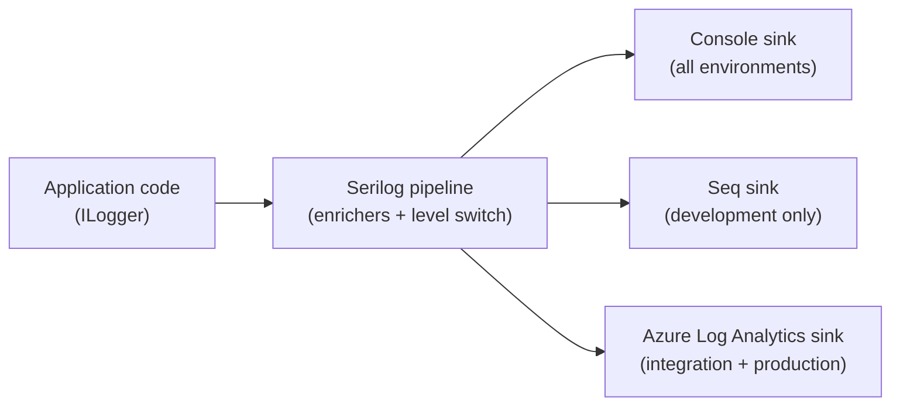

# Structured Logging

TinyHeroes uses [Serilog](https://serilog.net/) for structured JSON logging across all environments. Every log entry is a machine-readable JSON object with named fields, not a plain string.

---

## Table of Contents

- [Architecture overview](#architecture-overview)
- [Default log levels](#default-log-levels)
- [What each log entry contains](#what-each-log-entry-contains)
- [Local development](#local-development)
- [Integration and Production](#integration-and-production)
- [Runtime level control](#runtime-level-control)
- [How to add log statements in code](#how-to-add-log-statements-in-code)
- [Configuration files](#configuration-files)

---

## Architecture overview



All code uses the standard `ILogger<T>` abstraction — no Serilog types in application code.

---

## Default log levels

| Environment | Default level | Why |
|---|---|---|
| Development | `Debug` | Full visibility during local work |
| Integration | `Debug` | Full visibility for pre-merge testing |
| Production | `Warning` | Reduce noise and cost; escalate on demand |

The level can be changed at runtime without restarting — see [Runtime level control](#runtime-level-control) below.

---

## What each log entry contains

Every request log entry is enriched with:

| Field | Source | Example |
|---|---|---|
| `RequestId` | `HttpContext.TraceIdentifier` | `0HNB2QBHK5UPK:00000001` |
| `UserId` | JWT claim (`NameIdentifier`) | `3fa85f64-...` or `anon` |
| `UserAgent` | `User-Agent` request header | `Mozilla/5.0 ...` |
| `MachineName` | Host name | `lw0sdlwk000GH1` |
| `ThreadId` | Thread ID | `7` |

These are added by `UseSerilogRequestLogging` in `Program.cs` — they attach to the request-completion log event automatically.

---

## Local development

The Docker stack includes a [Seq](https://datalust.co/seq) instance. Start it with:

```bash
docker compose up -d
```

Seq is the log viewer for local development. It receives structured logs from the running API and lets you filter, search, and inspect individual fields. To query logs from the running API, open Seq in your browser (see `docs/development.md` for the URL).

**Example Seq query — all errors in the last hour:**
```
Level = 'Error' and @t > Now() - 1h
```

**Example Seq query — requests from a specific user:**
```
UserId = '3fa85f64-5717-4562-b3fc-2c963f66afa6'
```

### Checking Serilog sink health

If you suspect the Azure sink is failing silently, `[SERILOG]` prefixed lines appear in the container stdout. In the Docker stack:

```bash
docker compose logs api | grep SERILOG
```

Normal output: `[SERILOG] Sending batch of N logs`  
Error output: `[SERILOG] <error message>` — this is the symptom to investigate.

---

## Integration and Production

Logs ship to an **Azure Log Analytics workspace** (`tinyheroes-logs`) via the Logs Ingestion API.

Each environment writes to a separate custom table:

| Environment | Table | KQL prefix |
|---|---|---|
| Integration | `TinyHeroesApiIntegration_CL` | `TinyHeroesApiIntegration_CL \|` |
| Production | `TinyHeroesApi_CL` | `TinyHeroesApi_CL \|` |

### Log entry structure

The `Event` column is a `dynamic` (JSON) object containing the full Serilog event. The `Message` column is the rendered string. Query structured fields using KQL dynamic access:

```kusto
TinyHeroesApiIntegration_CL
| extend
    level      = tostring(Event.Level),
    userId     = tostring(Event.Properties.UserId),
    requestId  = tostring(Event.Properties.RequestId),
    statusCode = toint(Event.Properties.StatusCode),
    elapsed    = todouble(Event.Properties.Elapsed)
| where level == "Error"
| project TimeGenerated, Message, userId, requestId
| order by TimeGenerated desc
```

**Cross-environment comparison:**
```kusto
union TinyHeroesApi_CL, TinyHeroesApiIntegration_CL
| extend env = iif(Type == "TinyHeroesApi_CL", "production", "integration")
| extend level = tostring(Event.Level)
| where level == "Error"
| summarize count() by env, bin(TimeGenerated, 1h)
| order by TimeGenerated desc
```

### Credentials

The five Azure sink credentials are injected into each App Service as Application Settings. They are never in code or committed config. The values live in Azure Portal → App Service → Settings → Environment variables, or can be retrieved with:

```bash
az webapp config appsettings list \
  --name tinyheroes-api-integration \
  --resource-group rg-tinyheroes \
  --query "[?contains(name,'Serilog')]"
```

See `docs/deployment.md` for the full setup guide.

---

## Runtime level control

The minimum log level can be changed **without restarting** via two authenticated API endpoints. Any user with `FamilyRole.Admin` in at least one family can change the level.

```
GET  /api/admin/log-level          → { "level": "Warning" }
POST /api/admin/log-level          { "level": "Debug" }   → { "level": "Debug" }
```

Valid levels (case-insensitive): `Verbose`, `Debug`, `Information`, `Warning`, `Error`, `Fatal`

The level resets to the configured default on the next process restart or redeploy.

**Typical incident workflow:**

```bash
# 1. Escalate to Debug to see full detail
curl -X POST https://api.integration.mytinyheroes.net/api/admin/log-level \
  -H "Authorization: Bearer <your-jwt>" \
  -H "Content-Type: application/json" \
  -d '{"level": "Debug"}'

# 2. Reproduce the problem — logs now include Debug-level entries

# 3. Query the workspace (or watch Seq locally)

# 4. Reset manually when done (or wait for next deploy)
curl -X POST https://api.integration.mytinyheroes.net/api/admin/log-level \
  -H "Authorization: Bearer <your-jwt>" \
  -H "Content-Type: application/json" \
  -d '{"level": "Warning"}'
```

---

## How to add log statements in code

Use the standard ASP.NET Core `ILogger<T>` — inject it and call structured logging methods:

```csharp
public class FamilyService(ILogger<FamilyService> logger, AppDbContext db)
{
    public async Task DoSomethingAsync(Guid familyId)
    {
        // Structured — fields are queryable in Seq/Log Analytics
        logger.LogInformation("Starting deed summary for {FamilyId}", familyId);

        // Include context for debugging
        logger.LogDebug("Query params: {FamilyId} {WeekStart}", familyId, weekStart);

        // Exceptions with full stack trace
        logger.LogError(ex, "Failed to compute summary for {FamilyId}", familyId);
    }
}
```

Use **named placeholders** (`{FamilyId}`, not `$"FamilyId: {familyId}"`). Serilog captures the value as a structured field, not just a string — you can then filter on it in Seq or KQL.

### Attaching extra context to a scope

```csharp
using (logger.BeginScope(new { FamilyId = familyId, UserId = userId }))
{
    // All log entries emitted inside this block will carry FamilyId and UserId
}
```

---

## Configuration files

| File | Purpose |
|---|---|
| `appsettings.json` | Base: Console sink, `InitialMinimumLevel: Warning` |
| `appsettings.Development.json` | Dev override: Seq sink, `InitialMinimumLevel: Debug` |
| `appsettings.Integration.json` | Integration override: Azure sink, `InitialMinimumLevel: Debug` |
| `appsettings.Production.json` | Production override: Azure sink, `InitialMinimumLevel: Warning` |

`InitialMinimumLevel` is a custom key read by `Program.cs` to seed the `LoggingLevelSwitch`. It is not a native Serilog config key — do not rename it to `MinimumLevel`, which would conflict with `ReadFrom.Configuration` and break the runtime level switch.

The `configSettings: {}` entry in the Azure sink Args is required for `Serilog.Settings.Configuration` to resolve the correct method overload. Removing it causes the sink to be silently skipped at startup.
