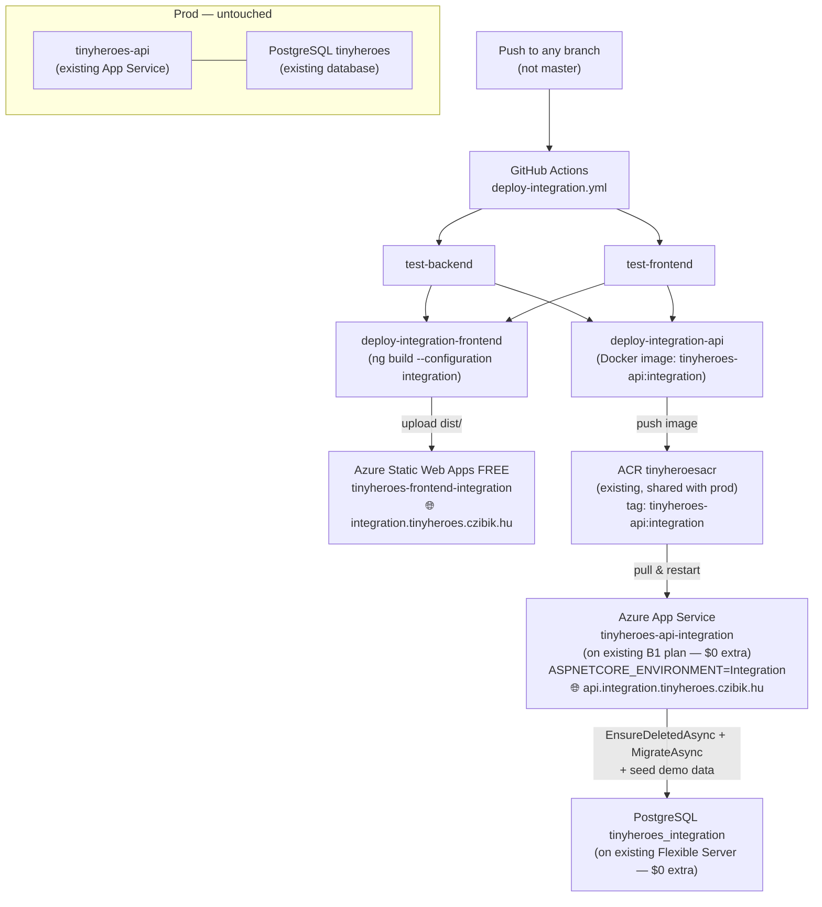
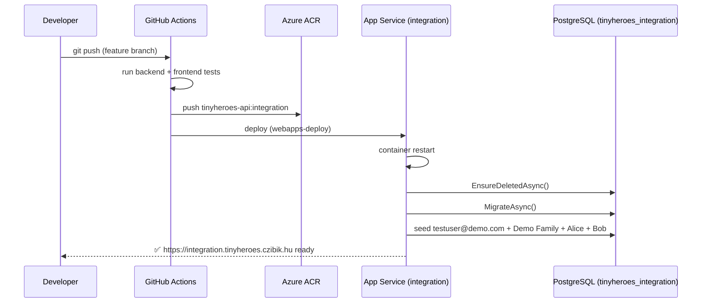

# Integration Environment Implementation Plan

> **For agentic workers:** REQUIRED SUB-SKILL: Use superpowers:subagent-driven-development (recommended) or superpowers:executing-plans to implement this plan task-by-task. Steps use checkbox (`- [ ]`) syntax for tracking.

**Goal:** Stand up a permanent `integration.tinyheroes.czibik.hu` environment on Azure that auto-deploys on every push to any non-master branch, drops and reseeds its own Postgres database with the demo family on each API restart, and is fully isolated from production.

**Architecture:**
All existing Azure resources are reused — zero additional monthly cost. A second web app is added to the existing B1 App Service Plan (Azure charges per plan, not per app). A `tinyheroes_integration` database is added to the existing PostgreSQL Flexible Server. A new Free-tier Static Web App ($0) hosts the integration frontend. A third Angular build configuration (`integration`) replaces `environment.ts` with `environment.integration.ts` pointing `apiUrl` at `https://api.integration.tinyheroes.czibik.hu/api`. A new GitHub Actions workflow (`deploy-integration.yml`) triggers on push to any branch other than `master`, runs tests, then builds and deploys both services. `ASPNETCORE_ENVIRONMENT=Integration` on the App Service triggers `DatabaseSeeder` at every cold start, dropping `tinyheroes_integration` and reseeding demo data — fully isolated from the production `tinyheroes` database on the same server.

**Tech Stack:** .NET 10 (`DatabaseSeeder`, `Program.cs`), Angular 21 (new build config + environment file), Azure App Service (existing plan) + Static Web App Free, Azure Bicep, GitHub Actions.

**Additional monthly cost: $0** — all compute and database resources reuse existing provisioned capacity.

---

## High-Level Architecture





---

## File Map

| File | Action | Responsibility |
|---|---|---|
| `backend/TinyHeroes.Infrastructure/Data/DatabaseSeeder.cs` | **Create** | Drops DB, runs migrations, seeds demo data |
| `backend/TinyHeroes.Api/Program.cs` | **Modify** | Call seeder when `ASPNETCORE_ENVIRONMENT=Integration` |
| `frontend/src/environments/environment.integration.ts` | **Create** | Angular env pointing at integration API URL |
| `frontend/angular.json` | **Modify** | Add `integration` build configuration |
| `infra/modules/appservice-integration.bicep` | **Create** | Web app on existing plan for integration API |
| `infra/main.integration.bicep` | **Create** | Integration stack Bicep entry point (references existing resources) |
| `infra/main.integration.bicepparam` | **Create** | Non-secret params for integration stack |
| `.github/workflows/deploy-integration.yml` | **Create** | CI/CD pipeline for non-master branches |
| `docs/deployment.md` | **Modify** | Add integration environment section |
| `CHANGELOG.md` | **Modify** | Add entry under `## [Unreleased]` |

---

## Task 1: DatabaseSeeder class

**Files:**
- Create: `backend/TinyHeroes.Infrastructure/Data/DatabaseSeeder.cs`

- [ ] **Step 1: Write the class**

```csharp
using Microsoft.AspNetCore.Identity;
using Microsoft.EntityFrameworkCore;
using TinyHeroes.Domain.Entities;
using TinyHeroes.Domain.Enums;

namespace TinyHeroes.Infrastructure.Data;

public static class DatabaseSeeder
{
    public static async Task SeedAsync(AppDbContext db, UserManager<User> userManager)
    {
        await db.Database.EnsureDeletedAsync();
        await db.Database.MigrateAsync();

        var user = new User
        {
            Id = Guid.Parse("00000000-0000-0000-0000-000000000001"),
            UserName = "testuser@demo.com",
            NormalizedUserName = "TESTUSER@DEMO.COM",
            Email = "testuser@demo.com",
            NormalizedEmail = "TESTUSER@DEMO.COM",
            EmailConfirmed = true,
            DisplayName = "Demo Parent",
            PreferredLanguage = "en",
            CreatedAt = DateTime.UtcNow
        };
        var result = await userManager.CreateAsync(user, "Password1!");
        if (!result.Succeeded)
            throw new InvalidOperationException(
                $"Seeding user failed: {string.Join(", ", result.Errors.Select(e => e.Description))}");

        var familyId = Guid.Parse("00000000-0000-0000-0000-000000000002");
        var family = new Family
        {
            Id = familyId,
            Name = "Demo Family",
            WeekStartDay = DayOfWeek.Monday,
            CreatedByUserId = user.Id,
            JoinCode = "DEMO0001",
            CreatedAt = DateTime.UtcNow
        };
        db.Families.Add(family);

        db.FamilyMembers.Add(new FamilyMember
        {
            Id = Guid.NewGuid(),
            FamilyId = familyId,
            UserId = user.Id,
            Role = FamilyRole.Admin,
            JoinedAt = DateTime.UtcNow
        });

        db.Children.Add(new Child
        {
            Id = Guid.NewGuid(),
            FamilyId = familyId,
            Name = "Alice",
            Age = 5,
            Gender = Gender.Girl,
            AvatarEmoji = "🦸",
            CreatedAt = DateTime.UtcNow
        });
        db.Children.Add(new Child
        {
            Id = Guid.NewGuid(),
            FamilyId = familyId,
            Name = "Bob",
            Age = 7,
            Gender = Gender.Boy,
            AvatarEmoji = "🦸",
            CreatedAt = DateTime.UtcNow
        });

        await db.SaveChangesAsync();
    }
}
```

- [ ] **Step 2: Commit**

```bash
git add backend/TinyHeroes.Infrastructure/Data/DatabaseSeeder.cs
git commit -m "feat: add DatabaseSeeder for integration environment"
```

---

## Task 2: Wire seeder into Program.cs

**Files:**
- Modify: `backend/TinyHeroes.Api/Program.cs` — the DB migration block (~lines 156–163)

- [ ] **Step 1: Replace the existing migration block**

Find this existing block:
```csharp
using (var scope = app.Services.CreateScope())
{
    var dbContext = scope.ServiceProvider.GetRequiredService<AppDbContext>();
    if (dbContext.Database.IsRelational())
        dbContext.Database.Migrate();
    else
        dbContext.Database.EnsureCreated();
}
```

Replace with:
```csharp
using (var scope = app.Services.CreateScope())
{
    var dbContext = scope.ServiceProvider.GetRequiredService<AppDbContext>();
    if (app.Environment.IsEnvironment("Integration"))
    {
        var userManager = scope.ServiceProvider.GetRequiredService<UserManager<User>>();
        await DatabaseSeeder.SeedAsync(dbContext, userManager);
    }
    else if (dbContext.Database.IsRelational())
    {
        dbContext.Database.Migrate();
    }
    else
    {
        dbContext.Database.EnsureCreated();
    }
}
```

Ensure these using directives are present at the top of `Program.cs` (add if missing):
```csharp
using TinyHeroes.Infrastructure.Data;
using Microsoft.AspNetCore.Identity;
using TinyHeroes.Domain.Entities;
```

- [ ] **Step 2: Verify the build compiles**

```bash
cd backend && dotnet build TinyHeroes.Api
```
Expected: `Build succeeded. 0 Error(s).`

- [ ] **Step 3: Verify existing tests still pass**

```bash
cd backend && dotnet test
```
Expected: All tests pass. (Tests use `EnsureCreated` via InMemory — the `Integration` branch is never triggered.)

- [ ] **Step 4: Commit**

```bash
git add backend/TinyHeroes.Api/Program.cs
git commit -m "feat: wire DatabaseSeeder into Program.cs for Integration environment"
```

---

## Task 3: Angular integration environment file and build config

**Files:**
- Create: `frontend/src/environments/environment.integration.ts`
- Modify: `frontend/angular.json`

- [ ] **Step 1: Create the integration environment file**

```typescript
export const environment = {
  production: true,
  apiUrl: 'https://api.integration.tinyheroes.czibik.hu/api',
  version: '2.4.0',
};
```

- [ ] **Step 2: Add `integration` build configuration to `angular.json`**

In `angular.json`, find the `"configurations"` object under `projects.frontend.architect.build`. It currently contains `"production"` and `"development"`. Add `"integration"` immediately after `"production"`:

```json
"integration": {
  "fileReplacements": [
    {
      "replace": "src/environments/environment.ts",
      "with": "src/environments/environment.integration.ts"
    }
  ],
  "optimization": true,
  "outputHashing": "all",
  "sourceMap": false,
  "namedChunks": false,
  "aot": true,
  "extractLicenses": true,
  "vendorChunk": false,
  "buildOptimizer": true
}
```

- [ ] **Step 3: Verify the integration build works**

```bash
cd frontend && npx ng build --configuration integration
```
Expected: Build completes successfully in `dist/frontend/browser/`. Grep the output JS to confirm the integration API URL is embedded:
```bash
grep -r "api.integration.tinyheroes" frontend/dist/frontend/browser/ | head -1
```
Expected: One or more matches found.

- [ ] **Step 4: Commit**

```bash
git add frontend/src/environments/environment.integration.ts frontend/angular.json
git commit -m "feat: add Angular integration build configuration"
```

---

## Task 4: Bicep — integration App Service module

**Files:**
- Create: `infra/modules/appservice-integration.bicep`
- Modify: `infra/modules/appservice.bicep` — add `alwaysOn: true` to prod `siteConfig`

This adds a web app to the **existing** App Service Plan — no new plan is provisioned.

Each web app has its own independent cold-start lifecycle on the shared plan. The proposal:
- **Prod** (`tinyheroes-api`): `alwaysOn: true` — never cold-starts for real users
- **Integration** (`tinyheroes-api-integration`): `alwaysOn: false` (default, omitted) — sleeps when unused (~15–30s cold start on first access, acceptable for developers), holds zero RAM on the shared B1 plan when idle

- [ ] **Step 1: Add `alwaysOn: true` to prod `infra/modules/appservice.bicep`**

In `appservice.bicep`, find the `siteConfig:` block and add `alwaysOn: true` as the first property:

```bicep
siteConfig: {
  alwaysOn: true
  linuxFxVersion: 'DOCKER|${acrLoginServer}/tinyheroes-api:latest'
  appSettings: [
    // ... existing settings unchanged ...
  ]
}
```

- [ ] **Step 2: Write `infra/modules/appservice-integration.bicep`**

Note: no `alwaysOn` property — defaults to `false`, integration app sleeps when unused.

```bicep
param name string
param location string
param existingAppServicePlanName string
param acrLoginServer string
param acrUsername string

@secure()
param acrPassword string

@secure()
param postgresConnectionString string

@secure()
param jwtSecret string

param allowedOrigin string

resource existingPlan 'Microsoft.Web/serverfarms@2023-01-01' existing = {
  name: existingAppServicePlanName
}

resource webApp 'Microsoft.Web/sites@2023-01-01' = {
  name: name
  location: location
  properties: {
    serverFarmId: existingPlan.id
    httpsOnly: true
    siteConfig: {
      linuxFxVersion: 'DOCKER|${acrLoginServer}/tinyheroes-api:integration'
      appSettings: [
        { name: 'DOCKER_REGISTRY_SERVER_URL', value: 'https://${acrLoginServer}' }
        { name: 'DOCKER_REGISTRY_SERVER_USERNAME', value: acrUsername }
        { name: 'DOCKER_REGISTRY_SERVER_PASSWORD', value: acrPassword }
        { name: 'WEBSITES_ENABLE_APP_SERVICE_STORAGE', value: 'false' }
        { name: 'ASPNETCORE_ENVIRONMENT', value: 'Integration' }
        { name: 'ConnectionStrings__Default', value: postgresConnectionString }
        { name: 'Jwt__Secret', value: jwtSecret }
        { name: 'Jwt__Issuer', value: 'tinyheroes-api' }
        { name: 'Jwt__Audience', value: 'tinyheroes-frontend' }
        { name: 'Jwt__ExpiryMinutes', value: '60' }
        { name: 'Storage__ConnectionString', value: 'disk://path=./uploads' }
        { name: 'AllowedOrigins__0', value: allowedOrigin }
        { name: 'WEBSITES_PORT', value: '8080' }
      ]
    }
  }
}

output hostname string = webApp.properties.defaultHostName
output name string = webApp.name
```

> **Why `disk://path=./uploads` for storage?** The integration environment is ephemeral — deed images are wiped alongside the database on each restart. No Blob Storage account is needed.

- [ ] **Step 3: Commit**

```bash
git add infra/modules/appservice-integration.bicep infra/modules/appservice.bicep
git commit -m "infra: add integration App Service module; enable alwaysOn on prod"
```

---

## Task 5: Bicep — integration stack entry point

**Files:**
- Create: `infra/main.integration.bicep`
- Create: `infra/main.integration.bicepparam`

References the existing ACR, App Service Plan, and Postgres server — provisions only the new web app, the integration database, and the new SWA.

- [ ] **Step 1: Write `infra/main.integration.bicep`**

```bicep
param location string = 'northeurope'
param swaLocation string = 'westeurope'
param prefix string = 'tinyheroes'
param repositoryUrl string
param integrationBranch string = 'integration'

@secure()
param postgresAdminPassword string

@secure()
param jwtSecret string

@secure()
param repositoryToken string

// Reference existing resources — do not redeploy them
resource existingAcr 'Microsoft.ContainerRegistry/registries@2023-07-01' existing = {
  name: '${prefix}acr'
}

resource existingPostgres 'Microsoft.DBforPostgreSQL/flexibleServers@2023-06-01-preview' existing = {
  name: '${prefix}-pg'
}

// Add integration database to the existing Postgres server
resource integrationDatabase 'Microsoft.DBforPostgreSQL/flexibleServers/databases@2023-06-01-preview' = {
  parent: existingPostgres
  name: 'tinyheroes_integration'
}

module appservice 'modules/appservice-integration.bicep' = {
  name: 'appservice-integration'
  params: {
    name: '${prefix}-api-integration'
    location: location
    existingAppServicePlanName: '${prefix}-api-plan'
    acrLoginServer: existingAcr.properties.loginServer
    acrUsername: existingAcr.name
    acrPassword: listCredentials(existingAcr.id, '2023-07-01').passwords[0].value
    postgresConnectionString: 'Host=${existingPostgres.properties.fullyQualifiedDomainName};Database=tinyheroes_integration;Username=tinyheroes;Password=${postgresAdminPassword};SslMode=Require'
    jwtSecret: jwtSecret
    allowedOrigin: 'https://integration.tinyheroes.czibik.hu'
  }
  dependsOn: [integrationDatabase]
}

module swa 'modules/swa.bicep' = {
  name: 'swa-integration'
  params: {
    name: '${prefix}-frontend-integration'
    location: swaLocation
    repositoryUrl: repositoryUrl
    branch: integrationBranch
    repositoryToken: repositoryToken
  }
}

output appServiceName string = appservice.outputs.name
output appServiceHostname string = appservice.outputs.hostname
output swaHostname string = swa.outputs.hostname
```

> **`dependsOn: [integrationDatabase]`** — The App Service must not start before the DB exists, since `DatabaseSeeder` runs on first startup and would fail if `tinyheroes_integration` doesn't exist yet.

- [ ] **Step 2: Write `infra/main.integration.bicepparam`**

```bicep
using './main.integration.bicep'

param location = 'northeurope'
param prefix = 'tinyheroes'
param repositoryUrl = 'https://github.com/DARKinVADER/TinyHeroes'
param integrationBranch = 'integration'

// Secrets are passed via CLI --parameters flags — never committed here:
// postgresAdminPassword, jwtSecret, repositoryToken
```

- [ ] **Step 3: Commit**

```bash
git add infra/main.integration.bicep infra/main.integration.bicepparam
git commit -m "infra: add integration stack Bicep (reuses existing App Service Plan and Postgres server)"
```

---

## Task 6: GitHub Actions — integration deployment workflow

**Files:**
- Create: `.github/workflows/deploy-integration.yml`

- [ ] **Step 1: Write the workflow**

```yaml
name: Deploy to Integration

env:
  FORCE_JAVASCRIPT_ACTIONS_TO_NODE24: true

permissions:
  contents: read
  checks: write

on:
  push:
    branches-ignore:
      - master

jobs:
  test-backend:
    name: Backend Tests
    runs-on: ubuntu-latest
    steps:
      - uses: actions/checkout@v4

      - uses: actions/setup-dotnet@v4
        with:
          dotnet-version: '10.x'

      - name: Restore
        run: dotnet restore backend/TinyHeroes.slnx

      - name: Build
        run: dotnet build backend/TinyHeroes.slnx --no-restore --configuration Release

      - name: Test
        run: >
          dotnet test backend/TinyHeroes.slnx
          --no-build --configuration Release
          --logger "trx;LogFileName=test-results.trx"
          --results-directory backend/TestResults
          --collect:"XPlat Code Coverage"
          --
          DataCollectionRunSettings.DataCollectors.DataCollector.Configuration.Format=lcov

      - name: Publish backend test results
        if: success() || failure()
        uses: dorny/test-reporter@v2
        with:
          name: Backend Test Results (Integration)
          path: backend/TestResults/*.trx
          reporter: dotnet-trx

  test-frontend:
    name: Frontend Tests
    runs-on: ubuntu-latest
    steps:
      - uses: actions/checkout@v4

      - uses: actions/setup-node@v4
        with:
          node-version: '22'
          cache: npm
          cache-dependency-path: frontend/package-lock.json

      - name: Upgrade npm
        run: npm install -g npm@11

      - name: Install dependencies
        run: npm ci
        working-directory: frontend

      - name: Install Playwright browsers
        run: npx playwright install --with-deps chromium
        working-directory: frontend

      - name: Run frontend e2e tests
        run: npm run e2e -- --reporter=line,junit
        working-directory: frontend
        env:
          PLAYWRIGHT_JUNIT_OUTPUT_FILE: test-results/e2e-junit.xml

      - name: Publish frontend test results
        if: success() || failure()
        uses: dorny/test-reporter@v2
        with:
          name: Frontend Test Results (Integration)
          path: frontend/test-results/e2e-junit.xml
          reporter: java-junit

      - name: Run frontend unit tests with coverage
        if: success() || failure()
        run: npm run test:coverage
        working-directory: frontend

  deploy-integration-frontend:
    name: Frontend → Integration Static Web Apps
    needs: [test-backend, test-frontend]
    runs-on: ubuntu-latest
    steps:
      - uses: actions/checkout@v4

      - uses: actions/setup-node@v4
        with:
          node-version: '22'
          cache: npm
          cache-dependency-path: frontend/package-lock.json

      - name: Upgrade npm
        run: npm install -g npm@11

      - name: Install dependencies
        run: npm ci
        working-directory: frontend

      - name: Build (integration configuration)
        run: npx ng build --configuration integration
        working-directory: frontend

      - name: Deploy to Integration Static Web Apps
        uses: Azure/static-web-apps-deploy@v1
        with:
          azure_static_web_apps_api_token: ${{ secrets.AZURE_STATIC_WEB_APPS_API_TOKEN_INTEGRATION }}
          action: upload
          app_location: frontend/dist/frontend/browser
          skip_app_build: true

  deploy-integration-api:
    name: Backend → Integration App Service
    needs: [test-backend, test-frontend]
    runs-on: ubuntu-latest
    steps:
      - uses: actions/checkout@v4

      - name: Log in to Azure Container Registry
        uses: docker/login-action@v3
        with:
          registry: ${{ secrets.ACR_LOGIN_SERVER }}
          username: ${{ secrets.ACR_USERNAME }}
          password: ${{ secrets.ACR_PASSWORD }}

      - name: Build and push Docker image (integration tag)
        uses: docker/build-push-action@v5
        with:
          context: backend
          file: backend/TinyHeroes.Api/Dockerfile
          push: true
          tags: ${{ secrets.ACR_LOGIN_SERVER }}/tinyheroes-api:integration

      - name: Deploy to Integration App Service
        uses: azure/webapps-deploy@v3
        with:
          app-name: ${{ secrets.AZURE_APP_SERVICE_NAME_INTEGRATION }}
          publish-profile: ${{ secrets.AZURE_WEBAPP_PUBLISH_PROFILE_INTEGRATION }}
          images: ${{ secrets.ACR_LOGIN_SERVER }}/tinyheroes-api:integration
```

> **Why `branches-ignore: [master]`?** This is the simplest trigger — every feature branch push deploys to the shared integration environment. All branches deploy to the same single integration URL; there is only one integration App Service and one integration SWA. This matches the issue description ("deploying new development from feature branch") without the complexity of per-branch ephemeral environments.

- [ ] **Step 2: Commit**

```bash
git add .github/workflows/deploy-integration.yml
git commit -m "ci: add deploy-integration.yml workflow for feature branches"
```

---

## Task 7: Provision Azure integration resources (one-time manual step)

This task is performed once by the developer. It adds a new web app to the existing App Service Plan, creates the `tinyheroes_integration` database on the existing Postgres server, and provisions the new Free-tier SWA.

- [ ] **Step 1: Run the Bicep deployment**

```bash
az deployment group create \
  --resource-group rg-tinyheroes \
  --template-file infra/main.integration.bicep \
  --parameters infra/main.integration.bicepparam \
  --parameters \
    postgresAdminPassword="<same-password-as-prod-postgres>" \
    jwtSecret="<any-32+-char-string>" \
    repositoryToken="<same-github-pat-as-prod-or-new-one>"
```

Note the outputs:
```
appServiceName      → tinyheroes-api-integration
appServiceHostname  → tinyheroes-api-integration.azurewebsites.net
swaHostname         → <hash>.azurestaticapps.net
```

- [ ] **Step 2: Collect integration secrets**

```bash
# SWA deployment token
az staticwebapp secrets list --name tinyheroes-frontend-integration --query properties.apiKey -o tsv

# App Service publish profile (full XML)
az webapp deployment list-publishing-profiles \
  --name tinyheroes-api-integration \
  --resource-group rg-tinyheroes \
  --xml
```

- [ ] **Step 3: Add GitHub secrets**

In the repo → Settings → Secrets and variables → Actions, add:

| Secret | Value |
|---|---|
| `AZURE_STATIC_WEB_APPS_API_TOKEN_INTEGRATION` | SWA token from step 2 |
| `AZURE_APP_SERVICE_NAME_INTEGRATION` | `tinyheroes-api-integration` |
| `AZURE_WEBAPP_PUBLISH_PROFILE_INTEGRATION` | Full XML from step 2 |

(ACR secrets `ACR_LOGIN_SERVER`, `ACR_USERNAME`, `ACR_PASSWORD` are shared with prod — already set.)

- [ ] **Step 4: Configure DNS**

Add two CNAMEs on the czibik.hu nameserver:

```
integration.tinyheroes     CNAME  <swaHostname from step 1>
api.integration.tinyheroes CNAME  tinyheroes-api-integration.azurewebsites.net
```

Then add custom domains in the Azure Portal:
- Static Web Apps (`tinyheroes-frontend-integration`) → Custom domains → `integration.tinyheroes.czibik.hu`
- App Service (`tinyheroes-api-integration`) → Custom domains → `api.integration.tinyheroes.czibik.hu`

SSL certificates auto-provision.

---

## Task 8: Update docs/deployment.md and CHANGELOG.md

**Files:**
- Modify: `docs/deployment.md`
- Modify: `CHANGELOG.md`

- [ ] **Step 1: Add integration environment section to `docs/deployment.md`**

Add after the existing "CI/CD Pipeline" section:

```markdown
---

## Integration Environment

A permanent integration environment mirrors production at `integration.tinyheroes.czibik.hu`.

| URL | Purpose |
|---|---|
| `https://integration.tinyheroes.czibik.hu` | Angular frontend |
| `https://api.integration.tinyheroes.czibik.hu` | .NET API |

### Trigger

Every push to any branch **except `master`** triggers `.github/workflows/deploy-integration.yml`, which:
1. Runs the full backend + frontend test suite
2. Builds the Angular app with the `integration` configuration (pointing at `api.integration.tinyheroes.czibik.hu/api`)
3. Pushes the Docker image to ACR as `tinyheroes-api:integration`
4. Deploys both services to the integration Azure resources

### Demo Credentials

The API starts with `ASPNETCORE_ENVIRONMENT=Integration`, which triggers `DatabaseSeeder` at every cold start:
- **URL:** `https://integration.tinyheroes.czibik.hu`
- **Email:** `testuser@demo.com`
- **Password:** `Password1!`
- **Family:** "Demo Family", children Alice (5) and Bob (7)

The database is dropped and reseeded on every API restart/redeploy.

### Azure Resources

| Resource | Name | Cost | Notes |
|---|---|---|---|
| Azure App Service (web app) | `tinyheroes-api-integration` | **$0 extra** | Added to existing B1 plan |
| Azure Static Web App (Free) | `tinyheroes-frontend-integration` | **$0** | Free tier |
| PostgreSQL database | `tinyheroes_integration` | **$0 extra** | Added to existing Flexible Server |

Shares existing ACR (`tinyheroesacr`) with image tag `tinyheroes-api:integration`. **Total additional monthly cost: $0.**

### Additional GitHub Secrets Required

| Secret | Description |
|---|---|
| `AZURE_STATIC_WEB_APPS_API_TOKEN_INTEGRATION` | SWA deployment token for integration |
| `AZURE_APP_SERVICE_NAME_INTEGRATION` | `tinyheroes-api-integration` |
| `AZURE_WEBAPP_PUBLISH_PROFILE_INTEGRATION` | Publish profile XML for integration App Service |

### First-Time Provisioning

```bash
az deployment group create \
  --resource-group rg-tinyheroes \
  --template-file infra/main.integration.bicep \
  --parameters infra/main.integration.bicepparam \
  --parameters \
    postgresAdminPassword="<password>" \
    jwtSecret="<32+-char-secret>" \
    repositoryToken="<github-pat>"
```

See Task 7 in the implementation plan for full first-time setup steps.
```

- [ ] **Step 2: Add CHANGELOG entry**

Under `## [Unreleased]` → `### Added`:

```markdown
- Integration environment: auto-deploys on push to any non-master branch to `integration.tinyheroes.czibik.hu`. Drops and reseeds the database with demo data (`testuser@demo.com / Password1!`, "Demo Family", children Alice and Bob) on every API restart.
```

- [ ] **Step 3: Commit**

```bash
git add docs/deployment.md CHANGELOG.md
git commit -m "docs: document integration environment in deployment.md and CHANGELOG"
```

---

## Verification

### After provisioning and first deploy

- [ ] Push a branch to GitHub. Confirm `deploy-integration.yml` triggers in GitHub Actions.
- [ ] Both test jobs pass. Both deploy jobs complete.
- [ ] Open `https://integration.tinyheroes.czibik.hu` — Angular app loads.
- [ ] Log in as `testuser@demo.com / Password1!` — lands on `/dashboard`, "Demo Family" visible with Alice and Bob.
- [ ] Add a deed to Alice. Verify it saves.
- [ ] Push the branch again (force push or a new commit). Confirm the new deploy runs. After the API restarts, log in again — Alice's deed is gone (database was reseeded). ✓ Clean state confirmed.
- [ ] Push to `master`. Confirm `deploy.yml` runs (production deploy) and `deploy-integration.yml` does **not** run.

### Existing production unaffected

- [ ] `https://tinyheroes.czibik.hu` still loads.
- [ ] Log in with a real production account — data intact.
- [ ] `GET https://api.tinyheroes.czibik.hu/api/info` returns `"environment": "Production"`.
