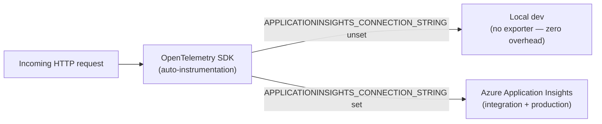

# Distributed Tracing

TinyHeroes uses [OpenTelemetry](https://opentelemetry.io/) for distributed tracing. Every HTTP request, outbound HTTP call, and database query is automatically captured as a span, and the spans are assembled into a full trace visible in Azure Application Insights.

---

## Table of Contents

- [Architecture](#architecture)
- [What is auto-instrumented](#what-is-auto-instrumented)
- [Viewing traces in Application Insights](#viewing-traces-in-application-insights)
- [Local development](#local-development)
- [Correlating traces with logs](#correlating-traces-with-logs)
- [Adding custom spans](#adding-custom-spans)
- [Adding tags to existing spans](#adding-tags-to-existing-spans)
- [What NOT to put in spans](#what-not-to-put-in-spans)

---

## Architecture



The OpenTelemetry SDK is always active — it collects spans in memory. The Azure Monitor exporter only activates when `APPLICATIONINSIGHTS_CONNECTION_STRING` is set (injected automatically by App Service in Azure). Locally the exporter is absent, so tracing has zero overhead and emits nothing.

---

## What is auto-instrumented

| Signal | Library | What you see in Application Insights |
|---|---|---|
| Incoming HTTP requests | `OpenTelemetry.Instrumentation.AspNetCore` | One root span per request: method, URL, status code, duration |
| Outbound HTTP calls | `OpenTelemetry.Instrumentation.Http` | Child span per `HttpClient` call (e.g. Hugging Face image API) |
| EF Core queries | `OpenTelemetry.Instrumentation.EntityFrameworkCore` | Child span per SQL statement: command type, duration |
| Runtime metrics | `OpenTelemetry.Instrumentation.Runtime` | GC collections, thread pool, heap size (metrics only, not traces) |

> SQL query text is intentionally excluded (`SetDbStatementForText = false`) to avoid PII leaking into telemetry and to reduce span payload size. The span still records the database name, command type, and duration.

---

## Viewing traces in Application Insights

### Transaction search

The fastest way to find a specific request:

1. Azure portal → Application Insights resource (`tinyheroes-api` or `tinyheroes-api-integration`)
2. **Investigate → Transaction search**
3. Filter by operation name (e.g. `POST /api/deeds`) or paste a request ID

Each result shows the full call tree: the root HTTP span, its EF Core child spans, and any outbound HTTP calls.

### Performance blade

For aggregate latency analysis:

1. **Investigate → Performance**
2. Select an operation (e.g. `GET /api/children/{id}`)
3. Click **Drill into → Samples** to see individual slow traces
4. Click any sample to open the end-to-end transaction view

### Live Metrics

Real-time view while the app is running:

1. **Investigate → Live Metrics**
2. Shows active requests, failure rate, and server response time with ~1-second latency

---

## Local development

Tracing is a no-op locally — `APPLICATIONINSIGHTS_CONNECTION_STRING` is unset in `.env.example`, so no spans are exported.

For local observability, use **Seq** (structured logs) at `http://localhost:5341`. Every request completion is logged with `RequestId`, `UserId`, status code, and elapsed time — sufficient for debugging without a trace viewer.

If you want to trace locally during development, set `APPLICATIONINSIGHTS_CONNECTION_STRING` to a real connection string in your `.env` file. Spans will be visible in the Azure portal within ~2 minutes. Use the integration Application Insights resource (`tinyheroes-api-integration`) for this — not production.

---

## Correlating traces with logs

Each Serilog request log carries a `RequestId` field (the `HttpContext.TraceIdentifier`, e.g. `0HNB2QBHK5UPK:00000001`). Application Insights uses its own W3C trace ID for spans. Both IDs appear side by side in the Application Insights Transaction details pane under **Related items**.

To find all logs for a specific request in Log Analytics:

```kusto
TinyHeroesApi_CL
| extend requestId = tostring(Event.Properties.RequestId)
| where requestId == "0HNB2QBHK5UPK:00000001"
| project TimeGenerated, Message, tostring(Event.Level)
| order by TimeGenerated asc
```

To find traces and logs together for the same time window:

```kusto
// Traces (Application Insights table)
AppRequests
| where TimeGenerated > ago(30m)
| where ResultCode >= 500
| project TraceId = tostring(Id), OperationName, ResultCode, DurationMs, TimeGenerated

// Logs (Serilog table)
// Join by approximate time — exact correlation requires propagating the trace ID into Serilog,
// which is not currently configured.
```

---

## Adding custom spans

Use `System.Diagnostics.ActivitySource` to wrap a block of work in its own named span. The span automatically becomes a child of whatever span is active at that point (e.g. the incoming HTTP request span).

### 1. Register the source name with OpenTelemetry

In `Program.cs`, extend the tracing builder:

```csharp
.WithTracing(tracing => tracing
    .AddAspNetCoreInstrumentation()
    .AddHttpClientInstrumentation()
    .AddEntityFrameworkCoreInstrumentation(opt => opt.SetDbStatementForText = false)
    .AddSource("TinyHeroes.Api"))   // ← add this line
```

### 2. Declare a static ActivitySource in your class

```csharp
// One static instance per logical component — cheap to create, thread-safe
private static readonly ActivitySource _activities = new("TinyHeroes.Api");
```

### 3. Start a span around the work

```csharp
public class HuggingFaceImageService(IHttpClientFactory httpFactory, ILogger<HuggingFaceImageService> logger)
    : IAiImageService
{
    private static readonly ActivitySource _activities = new("TinyHeroes.Api");

    public async Task<string> GenerateDataUrlAsync(string prompt, CancellationToken ct = default)
    {
        using var activity = _activities.StartActivity("GenerateImage");
        activity?.SetTag("ai.model", _model);
        activity?.SetTag("ai.prompt.length", prompt.Length);

        try
        {
            var result = await CallHuggingFaceAsync(prompt, ct);
            activity?.SetTag("ai.result.bytes", result.Length);
            return result;
        }
        catch (Exception ex)
        {
            activity?.SetStatus(ActivityStatusCode.Error, ex.Message);
            throw;
        }
    }
}
```

The span appears in Application Insights Transaction search as a child of the `POST /api/deeds` request span, showing exactly how long the image generation took within the full request.

---

## Adding tags to existing spans

To attach domain context (family ID, child ID) to the currently active span without creating a new one, use `Activity.Current`:

```csharp
// Inside a controller action or service method — adds tags to whatever span is active
Activity.Current?.SetTag("app.family_id", familyId.ToString());
Activity.Current?.SetTag("app.child_id", childId.ToString());
```

A good place to do this is in `ApiControllerBase` or in a middleware that resolves the family context early in the request pipeline. Once set, the tag is visible in Application Insights under the span's **Custom properties** section.

**Recommended tag naming convention** (aligned with OpenTelemetry semantic conventions):

| Context | Tag name |
|---|---|
| Family | `app.family_id` |
| Child | `app.child_id` |
| AI model | `ai.model` |
| AI prompt length | `ai.prompt.length` |

---

## What NOT to put in spans

Spans are shipped to Azure and retained for at least 90 days. Treat them like logs — avoid anything that would constitute PII or a secret:

- **No user input text** — deed descriptions, child names, family names
- **No email addresses or user IDs that map to individuals** (use opaque GUIDs only)
- **No JWT tokens, passwords, or API keys**
- **No SQL query text** — already excluded globally via `SetDbStatementForText = false`

Use lengths, counts, and flags instead of values:

```csharp
// ✅ Safe
activity?.SetTag("ai.prompt.length", prompt.Length);
activity?.SetTag("deed.has_image", imageUrl != null);

// ❌ Avoid — contains user content
activity?.SetTag("deed.description", deedDescription);
activity?.SetTag("user.email", email);
```
